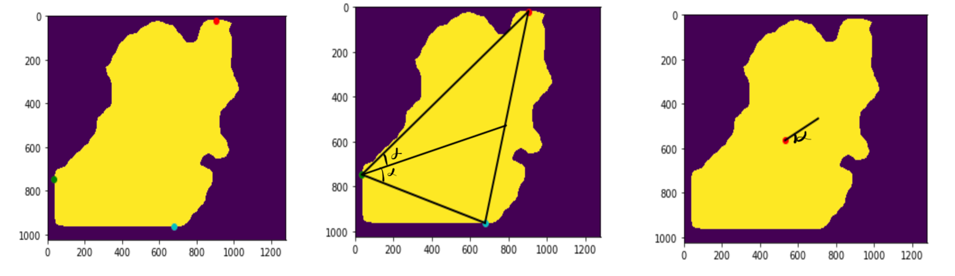

# "Detection and segmentation of tissue structures in laparoscopic image data using deep learning"

## Table of Content
1. [About the Project](#about)
1. [Dataset](#dataset)
1. [Getting started](#start)
1. [Repository structures](#repo)

## About The Project

This was a research project at the National Center for Tumor Diseases (NCT Dresden), which was developed between 2020 and 2021.
The project aimed to work tightly with the medical department and support the surgeons during operations.
For that was developed a novel dataset for the colon operation, annotated by the medical department.

The achieved results in the detection of various tissues and instruments were published at the [CURAC 2021 Conference](https://curac.org/de/curac2021/curac2021-programm)

In addition to tissue detection, the research project also covers an approach to suggest surgeons where to place a cut on a "first incision plane".
Based on a good achieved Intersection over Union score for the "first incision plane", it was made post-processing based on a triangulation technique of the plane.

## Dataset

Contains following phases:
- first incision
- pedicle package 
- vascular dissection
- mesocolon gerota
- lateral mobilisation 
- TME

## Getting started

Jupyter notebook `detectron/repo_structure_tutorial.ipynb` contains a step by step description of how to use the provided network.

## Repository structures 

1. `csv` here will be dumped the `csv` files and the `json` files 
    - `detectron/plane_evaluation/` stores everything connected with the plane
        - `gt_evaluation` stores a analysis of the resection lines GT annoatated from Matthias. 
        Here are all the parameters that can be compared further with the artificial constructed plane
        
        |               | Starting point of resection line | End point of resection line | lenght | Slope of the resection line in degrees |
        |---------------|----------------------------------|-----------------------------|--------|----------------------------------------|
        | Image from OP | [598,534]                        | [555,727]                   | 198    | 12.5                                   |
    

2. `configs` - contains configs file, which contain initialized parameter
    - `configs.yaml` - contains the default config file
    - `plane_config.yaml` - contains the config  for operation only on the plane

3. `data` - contains the nrrd files and the data from nrrd to  `.png` saved.
    - the `.png` data is in the folder `output`
    - `images` contains the 4th phase of the op, where only a mask need to be detected
    -  `images_new` is for the 1st phase -> where the resection line needs to be estimated
        - for the training and validation with detectron2 the directories have to have a form of:
        - `train`
        - `val`
        - `masks`
        - `masks_val` 
  
4. `detectron` contains files and directories connected with the Maks-RCNN approach implementation by FAIR.
    - `plane_processing` contains all the postprocessing files after the detection of the plane
        - `resec_line_length_estimation.py` is for analysing the training datasets resectrion line length. 
        This allows to estimate how long the line should be if we draw an artificial one. Saves this as `length.json` 
        - `img_gt_resec.py` contains the implementation of the construction of the resection line based on the planes centroids
        - `plane_evaluation.py` analyses the distance from the centroid to the neighrest point GT resection line point
        - `output` here will be various results of the constructed images with the artificial generated resection line saved
    - in the root:
        - `dataset_new_data.py` saves the images from NRRD and creates a description json which is needed for detectron2 training procedure.
        Parameter for saving and locations of the files are stored in the `config.yaml` under `CREATE_DATASET`
        - `nrrd_mapping.py` contains mapping for the layers of the various nrdds. This is needed because while annotating in Slicer App the mask layers f.e plane, resection line etc are created in a random order. This dict allows to get a consistent mapping over all OPs.
        - `detectron2_run.py`  performs the training and evaluation. Parameters are taken from `NEW` and `OLD`
        - `plane_dataset_creator.py` creating a dataset with plane only img 
    